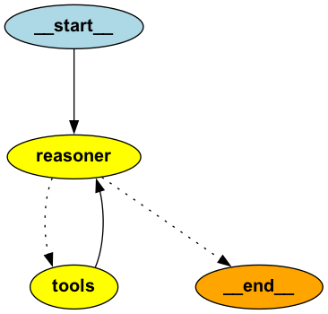

# LangGraph ReACT Agent Template

A simple implementation of a ReACT (Reasoning and Acting) agent using LangGraph and LangChain. This project demonstrates how to build a flexible agent architecture that can use tools to solve tasks through reasoning and action steps.

## Features

- 🤖 ReACT agent implementation using LangGraph
- 🛠️ Built-in tools for basic math operations and web search
- 📊 Visual graph representation of the agent's decision flow
- 🔄 Streaming support for real-time agent reasoning and actions
- 🎯 Modular architecture for easy tool addition

## Agent Graph Architecture

The agent follows a simple but effective graph-based architecture:



This graph shows how the agent:
1. Starts with a query
2. Uses the reasoner to decide what to do
3. Either uses tools and returns to reasoning, or
4. Completes the task if no more tools are needed

## Prerequisites

- Miniconda or Anaconda
- Python 3.13
- OpenAI API key (for GPT-4)
- GraphViz (for graph visualization)

## Installation

1. Clone the repository:
```bash
git clone 
cd langraph-react-agent
```

2. Create and activate the conda environment:
```bash
conda env create -f environment.yml
conda activate langraph_react_agent
```

3. Install project dependencies using Poetry:
```bash
poetry install
```

4. Create a `.env` file in the root directory and add your OpenAI API key:
```bash
OPENAI_API_KEY=your_api_key_here
```

### Installing GraphViz

For macOS:
```bash
brew install graphviz
```

For Ubuntu/Debian:
```bash
sudo apt-get install graphviz
```

For Windows:
```bash
winget install graphviz
```

## Usage

The agent can be run from the command line with various options:

```bash
poetry run python main.py --query "What is 25 multiplied by 48?"
```

### Command Line Options

- `--query`: The question or task for the agent to process
- `--graph`: Save the agent's decision graph as a PNG file
- `--markup`: Print the graph markup
- `--stream`: Stream the agent's thoughts and actions in real-time

### Example Usage

1. Basic calculation:
```bash
poetry run python main.py --query "What is 123 plus 456?"
```

2. Web search:
```bash
poetry run python main.py --query "What is the capital of France?"
```

3. View agent graph:
```bash
poetry run python main.py --graph
```

## Project Structure

```
.
├── agent/
│   └── agent.py          # Core agent implementation
├── tools/
│   ├── math_tools.py     # Basic math operations
│   └── search.py         # Web search functionality
├── main.py               # CLI interface
├── pyproject.toml        # Poetry configuration
├── environment.yml       # Conda environment specification
└── README.md            # Project documentation
```

## How It Works

The agent uses a ReACT (Reasoning and Acting) architecture implemented through LangGraph:

1. **Reasoning**: The agent receives a query and reasons about how to approach it
2. **Tool Selection**: Based on reasoning, it selects appropriate tools
3. **Action**: Executes the selected tools
4. **Observation**: Processes tool results and continues the cycle if needed

The agent's decision flow is represented as a graph with nodes for reasoning and tool execution.

## Available Tools

- Math Operations:
  - Addition
  - Subtraction
  - Multiplication
  - Division
- Web Search:
  - DuckDuckGo search integration

## Development

To add new tools:
1. Create a new function in the `tools` directory
2. Add type hints and docstrings (required for tool registration)
3. Import and add the tool to the list in `main.py`

## Contributing

Contributions are welcome! Feel free to submit issues and pull requests.

## License

[MIT License](LICENSE) 